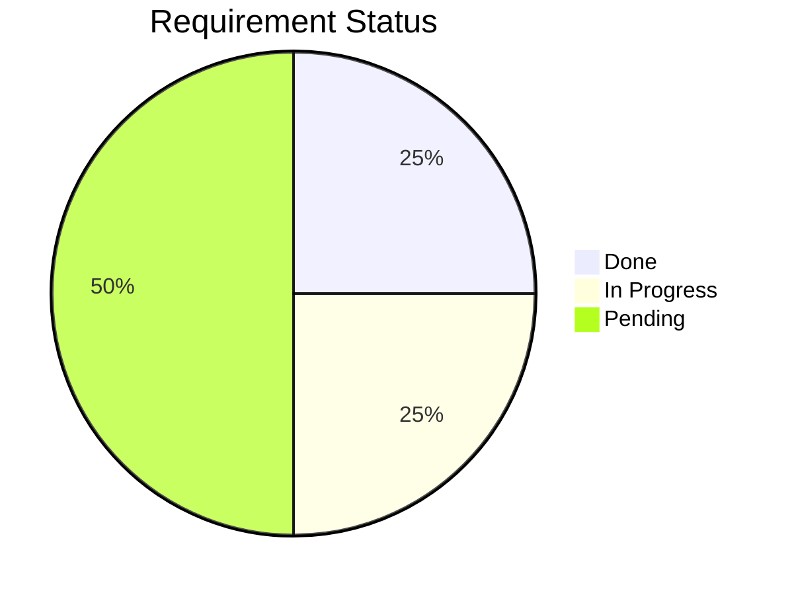
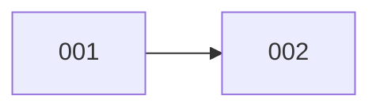

# Blueprint Management

The blueprint is the project-level document that provides a bird's-eye view of all requirements, their current phases, dependencies, and overall status.

The blueprint exists at `.dev/blueprint.md`, sitting alongside `TODO.md` at the top level of `.dev/`.

## When to Create

- **First Phase 01 run**: after creating `init.md`, create `.dev/blueprint.md` if it doesn't exist
- **Subsequent Phase 01 runs**: the file already exists — update it with the new requirement entry

## When to Update

| Event | Action |
|---|---|
| New requirement initialized (Phase 01 complete) | Add a new entry row. Set Round to 1. |
| Requirement advances to a new phase | Update Phase and Status columns |
| Round completes (all tasks done or blocked) | Update Status (`▶ in-progress` → `⏳ pending`). Note open issues and tasks completed in Notes. |
| Round N+1 starts (user confirms) | Increment Round counter. Set Status to `▶ in-progress`. Update Phase to `01 Init` or the re-entry phase. |
| Requirement fully completes (no open issues) | Set Phase to `07 Done`, Status to `✅ done` |
| Requirement is blocked | Set Status to `⏸ blocked`, add a note |
| Requirement priority or deps change | Update relevant columns |

## Blueprint Format

`.dev/blueprint.md`:

```markdown
# Project Blueprint

Last updated: 2026-05-10

## Status Distribution



## Progress Bar

```
001 user-auth     [████████░░░░░░░░░░░░] 40%
002 task-crud     [██░░░░░░░░░░░░░░░░░░] 10%

Overall:          [██████████░░░░░░░░░░] 25%
```

## Roadmap

| ID | Name | Phase | Status | Dependencies | Priority | Notes |
|---|---|---|---|---|---|---|
| 001 | user-auth | 07 Execution | ▶ in-progress | - | P0 | |
| 002 | task-crud | 01 Init | ⏳ pending | 001 | P1 | |

**Phase labels:** `01 Init` · `02 Prerequisite` · `03 Algorithm` · `04 Plan` · `05 Tasks` · `06 Start-and-resume` · `07 Execution` · `Round Review` · `Phase 01* (Next Round)` · `07 Done`

**Status labels:** `⏳ pending` · `▶ in-progress` · `⏸ blocked` · `✅ done`

**Priority labels:** `P0` blocking · `P1` core · `P2` nice-to-have

## Progress Summary

```
Total: 2 requirements
✅ Done:  0
▶ Active: 1 (001)
⏳ Idle:  1 (002)
```

## Key Dependencies



## Milestones

| Milestone | Target | Status | Requirements |
|---|---|---|---|
| v1.0 MVP | 2026-06-15 | ▶ on track | 001, 002 |

**Status labels:** `▶ on track` · `⚠ at risk` · `⏸ delayed` · `✅ achieved`

## Effort Overview

| Req | Name | Estimate | Actual | Remaining |
|-----|------|----------|--------|-----------|
| 001 | user-auth | L | M | ~2d |
| 002 | task-crud | XL | - | ~5d |
| **Total** | | | | **~7d** |

**Estimate labels:** `XS` ≤1d · `S` ≤3d · `M` ≤1w · `L` ≤2w · `XL` >2w

## Quick Reference

| Document | Location |
|---|---|
| Blueprint | `.dev/blueprint.md` |
| TODO (cross-req) | `.dev/TODO.md` |
| Requirement docs | `.dev/NNN-req-name/` |
```

## Reading the Blueprint

When the user asks for a project-level overview — progress summary, what's blocked, what's next, overall roadmap:

1. **Read 00-agent-execution.md § Handling Project Overview Queries** first — it defines the response format and rules
2. Read `.dev/blueprint.md` — project-level status
3. For each active requirement (`▶ in-progress` or `⏸ blocked`), read `tasks.md` and `init.md` for detail
4. Present the structured summary using the format defined in [00-agent-execution.md](../constitution/00-agent-execution.md)

## Resuming with Blueprint

When resuming work on a project (user returns after an interruption):

1. Read `.dev/blueprint.md` to see the overall landscape
2. Identify the highest-priority requirement in `⏳ pending` or `▶ in-progress`
3. **If the requirement has a Round > 1** (round-based execution in progress), read `issues.md` first to understand open issues from previous rounds
4. Read that requirement's `start-and-resume.md` for continuation context (includes Round History)
5. Read `tasks.md` for next task
6. Proceed with the next unstarted task

## Out of Scope (not tracked in blueprint)

- Task-level status within a requirement — use `tasks.md` for that
- Code-level details — use `plan.md` for that
- Individual commit history — use git log
